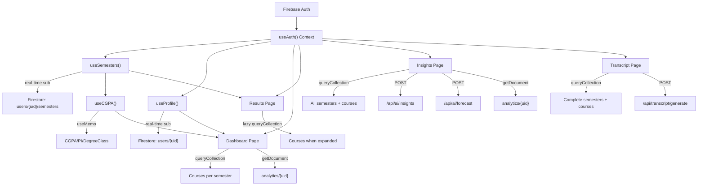
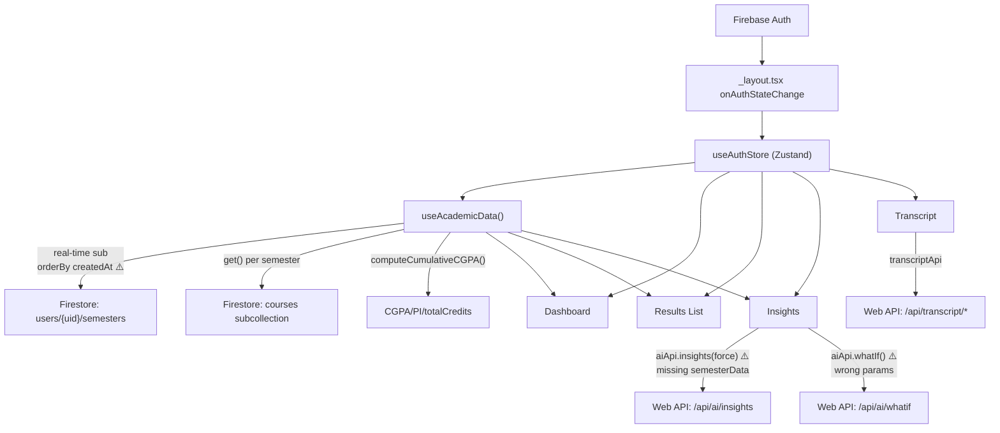

# AcadeGrade: Web vs Mobile Data Flow Analysis

## Executive Summary

The web version uses **direct Firestore real-time subscriptions** (via custom hooks) to fetch data, while the mobile version uses a **hybrid approach** — a single centralized `useAcademicData()` hook for Firestore data, plus a separate **HTTP API client** for AI features. There are **several critical mismatches** between the two that explain why data isn't displaying properly on mobile.

---

## Architecture Comparison at a Glance

| Aspect | Web (Next.js) | Mobile (Expo/RN) |
|---|---|---|
| **Auth** | `useAuth()` hook → React Context + `onAuthStateChanged` | `useAuthStore` (Zustand) → populated in `_layout.tsx` |
| **Semesters** | `useSemesters()` → real-time Firestore subscription | `useAcademicData()` → real-time Firestore subscription |
| **Courses** | Lazy-loaded per-page via `queryCollection()` | Pre-loaded ALL courses inside `useAcademicData()` |
| **CGPA/PI** | `useCGPA()` → derived from `useSemesters()` | `computeCumulativeCGPA()` → derived inside `useAcademicData()` |
| **Insights** | Direct API call + Firestore `analytics/{uid}` cache | `aiApi.insights()` HTTP call to web backend |
| **Transcript** | Direct Firestore fetch + API call for PDF | `transcriptApi` HTTP call to web backend |
| **Profile** | `useProfile()` → Firestore real-time sub | `useAuthStore` → populated once from `_layout.tsx` |

---

## Page-by-Page Breakdown

### 1. Dashboard

#### Web ([dashboard/page.tsx](file:///c:/Users/JOSHUA%20ZAZA/PROJECTS/acadegrade-fy-project-main/acadegrade-fy-project/app/(student)/dashboard/page.tsx))

Data sources consumed:
- `useAuth()` → `user` (Firebase user)
- `useProfile()` → `profile` (real-time Firestore sub to `users/{uid}`)
- `useCGPA()` → `cgpa`, `pi`, `degreeClass`, `semesterHistory`, `totalCredits`, `totalCourses`, `loading`
  - Internally calls `useSemesters()` → subscribes to `users/{uid}/semesters`
  - Computes CGPA/PI via `useMemo` from semester data
- **Courses fetched separately**: `queryCollection()` loops through each semester to:
  - Count total courses done
  - Count at-risk courses (totalScore < 50)
  - Pull the 3 most recent courses from the latest semester
- **AI summary**: `getDocument('analytics/{uid}')` to read cached insight
- **Advert**: `getDocument('config/settings')` to check for active ads

#### Mobile ([dashboard.tsx](file:///c:/Users/JOSHUA%20ZAZA/PROJECTS/acadegrade-mobile/acadegrade-mobile/app/(tabs)/dashboard.tsx))

Data sources consumed:
- `useAuthStore` → `profile`, `firebaseUser`
- `useAcademicData()` → `semesters`, `allCourses`, `cgpa`, `totalCredits`, `totalCourses`, `loading`

**Key differences & issues:**

| Feature | Web | Mobile | ⚠️ Issue |
|---|---|---|---|
| Profile data | Real-time Firestore sub (`useProfile`) | One-shot from `_layout.tsx` auth listener | Profile may be stale after edits |
| At-risk count | Counts courses with `totalScore < 50` | Counts courses with `grade === 'E' \|\| grade === 'F'` | **Different filter logic** — web is score-based, mobile is grade-based |
| Recent grades | Fetches last semester's courses separately | Filters `allCourses` by `updatedAt` timestamp | Works differently but should function |
| AI Summary | Fetches from `analytics/{uid}` Firestore doc | ❌ **Not implemented at all** | Missing feature |
| Advert | Reads from `config/settings` Firestore doc | ❌ **Not implemented** | Missing feature |
| Trend chart data | `semesterHistory` from `useCGPA()` | `semesters.map(s => ({x, gpa, pi}))` | Structurally similar, should work |

> [!WARNING]
> The `useAcademicData()` hook orders semesters by `createdAt` (`orderBy('createdAt', 'asc')`). If semesters created on **web** don't have a `createdAt` field (the web `useSemesters` hook orders by `level` instead), **the mobile query may return NO results** because Firestore's `orderBy` excludes documents where the ordered field doesn't exist. This is the most likely cause of empty data on mobile.

---

### 2. Results List

#### Web ([results/page.tsx](file:///c:/Users/JOSHUA%20ZAZA/PROJECTS/acadegrade-fy-project-main/acadegrade-fy-project/app/(student)/results/page.tsx))

- `useSemesters()` → real-time Firestore sub to `users/{uid}/semesters`, ordered by `level` ascending
- Each semester accordion lazy-loads courses via `queryCollection('users/{uid}/semesters/{semId}/courses')` when expanded
- Shows: label, level/semester badge, GPA, credit units, "Ongoing" badge if `!isComplete`

#### Mobile ([results/index.tsx](file:///c:/Users/JOSHUA%20ZAZA/PROJECTS/acadegrade-mobile/acadegrade-mobile/app/(tabs)/results/index.tsx))

- `useAcademicData()` → shares the same Firestore subscription, just different data shape
- Displays: label, session, creditLoaded, GPA
- Swipe-to-delete supported

**Key differences & issues:**

| Feature | Web | Mobile | ⚠️ Issue |
|---|---|---|---|
| Sort order | `orderBy('level', 'asc')` | `orderBy('createdAt', 'asc')` | **Critical mismatch** — if `createdAt` is missing, semesters won't appear |
| Courses loading | Lazy per-accordion | Pre-loaded via `useAcademicData()` | Different strategy but fine |
| Display fields | label, level badge, GPA, CU, isComplete badge | label, session, creditLoaded, GPA | Fewer details but functional |

---

### 3. Semester Detail (Edit Page)

#### Web ([results/[semesterId]/page.tsx](file:///c:/Users/JOSHUA ZAZA/PROJECTS/acadegrade-fy-project-main/acadegrade-fy-project/app/(student)/results/[semesterId]/page.tsx))

- Fetches semester doc + courses subcollection
- Full grade table with editing, grade computation
- OCR scan via `/api/results/extract`
- Writes computed GPA/PI back to semester doc

#### Mobile ([[semesterId].tsx](file:///c:/Users/JOSHUA%20ZAZA/PROJECTS/acadegrade-mobile/acadegrade-mobile/app/(tabs)/results/[semesterId].tsx))

- Real-time subscription to `users/{uid}/semesters/{semesterId}/courses`
- Manual course add + OCR scan (camera, gallery, document)
- Auto-writes GPA/PI back to semester doc via `useEffect`
- ✅ **This page is well-implemented** and closely mirrors the web

---

### 4. New Semester

#### Web ([results/new/page.tsx](file:///c:/Users/JOSHUA ZAZA/PROJECTS/acadegrade-fy-project-main/acadegrade-fy-project/app/(student)/results/new/page.tsx))

- Level picker, semester picker, session input
- Creates document in `users/{uid}/semesters`

#### Mobile ([results/new.tsx](file:///c:/Users/JOSHUA%20ZAZA/PROJECTS/acadegrade-mobile/acadegrade-mobile/app/(tabs)/results/new.tsx))

- Same fields: level, semester, session
- Creates same Firestore document shape
- ✅ **Correctly includes `createdAt` and `updatedAt` server timestamps**

> [!IMPORTANT]
> Semesters created via **web** do NOT write a `createdAt` field (the web `useSemesters` hook uses `orderBy('level')`, not `createdAt`). But the mobile's `useAcademicData()` does `orderBy('createdAt', 'asc')`. **Any semester created from the web will be invisible to the mobile app.**

---

### 5. Insights

#### Web ([insights/page.tsx](file:///c:/Users/JOSHUA%20ZAZA/PROJECTS/acadegrade-fy-project-main/acadegrade-fy-project/app/(student)/insights/page.tsx))

Complex multi-step data loading:

1. **Semesters**: `queryCollection('users/{uid}/semesters')` — manual sort by level/semester
2. **PI/CGPA history**: Computed from completed semesters — builds arrays of `piHistory[]` and `cgpaHistory[]`
3. **At-risk courses**: Loops through ALL completed semesters, fetches courses, filters `totalScore < 50`
4. **Analytics cache**: `getDocument('analytics/{uid}')` — checks for existing forecast + insights
5. **Forecast API**: `POST /api/ai/forecast` with `{ piHistory, cgpaHistory, forceRegenerate }`
6. **Written Insights API**: `POST /api/ai/insights` with `{ forceRegenerate, semesterData }`
7. **Degree class notification**: Compares previous vs new degree class, sends push + email if changed
8. **What-If Calculator**: Separate component, calls `POST /api/ai/whatif`
9. **12-hour cooldown**: Server-enforced rate limiting on written insights

#### Mobile ([insights.tsx](file:///c:/Users/JOSHUA%20ZAZA/PROJECTS/acadegrade-mobile/acadegrade-mobile/app/(tabs)/insights.tsx))

**Key differences & issues:**

| Feature | Web | Mobile | ⚠️ Issue |
|---|---|---|---|
| Semesters data | Fetches independently | Uses `useAcademicData()` | Fine |
| AI Insights call | `aiApi.insights(force, semesterData)` — sends full semester data | `aiApi.insights(force)` — **missing `semesterData` parameter!** | 🔴 **BROKEN** — the API needs semester data |
| What-If call | `aiApi.whatIf(currentCGPA, totalCredits, targetCGPA, remainingSemesters, creditLoad)` | `aiApi.whatIf(target, remainingSemesters, avgCredits)` — **missing `currentCGPA` and `totalCredits`!** | 🔴 **BROKEN** — wrong parameters |
| Forecast | Calls forecast API with both PI and CGPA histories | ❌ **Not called at all** | Missing feature |
| Risk Analysis tab | Full flagged courses display | Checks `insights?.riskCourses` (from API response) | Works if API returns it |
| Cooldown display | Timer with hours/minutes | Timer with hours/minutes | ✅ Similar |
| `insights.summary` | Doesn't exist on web response type | Mobile references it for typing animation | 🔴 **Field mismatch** — web returns `degreeOutlook`, not `summary` |

> [!CAUTION]
> The mobile insights page calls `aiApi.insights(force)` with only one argument, but the [API client](file:///c:/Users/JOSHUA%20ZAZA/PROJECTS/acadegrade-mobile/acadegrade-mobile/lib/api/client.ts#L139) expects `(forceRegenerate, semesterData)`. The second argument (`semesterData`) is never passed, meaning the API gets `undefined` for the semester data — which the server needs to generate insights. This guarantees empty/failed responses.

---

### 6. Transcript

#### Web ([transcript/page.tsx](file:///c:/Users/JOSHUA%20ZAZA/PROJECTS/acadegrade-fy-project-main/acadegrade-fy-project/app/(student)/transcript/page.tsx))

Heavy data loading:
1. Fetches ALL semesters + courses (filtered to `isComplete` only)
2. Computes cumulative CGPA from the full dataset
3. Renders a full visual transcript preview (header, photo, semester tables, CGPA arc)
4. PDF generation via `POST /api/transcript/generate`
5. Share link via `POST /api/transcript/share`
6. Manages shared links (list, delete expired)

#### Mobile ([transcript.tsx](file:///c:/Users/JOSHUA%20ZAZA/PROJECTS/acadegrade-mobile/acadegrade-mobile/app/(tabs)/transcript.tsx))

**Key differences & issues:**

| Feature | Web | Mobile | ⚠️ Issue |
|---|---|---|---|
| Academic data display | Full semester-by-semester table with courses | ❌ **No academic data displayed at all** | Only shows profile card + download/share buttons |
| CGPA Arc | Shows cumulative CGPA arc visualization | ❌ **Not shown** | Missing |
| Semester tables | Full course-by-course breakdown | ❌ **Not shown** | Missing |
| PDF generation | Works via API | Uses same `transcriptApi.generate()` | ✅ Should work |
| Share link | Full management UI | Basic share + clipboard | Simplified but functional |

> [!NOTE]
> The mobile transcript page is essentially a **stub** — it only renders the profile card and action buttons. It doesn't show any actual academic data preview. The web version renders a full rich transcript preview before downloading.

---

## Root Cause Analysis: Why Data Isn't Showing

### 🔴 Critical Issue #1: `orderBy('createdAt')` vs missing `createdAt` field

[useAcademicData.ts](file:///c:/Users/JOSHUA%20ZAZA/PROJECTS/acadegrade-mobile/acadegrade-mobile/lib/store/useAcademicData.ts#L39) (line 39):
```typescript
.orderBy('createdAt', 'asc')
```

The mobile hook orders by `createdAt`. But if your semesters were created via the **web app**, they may not have a `createdAt` field at all — the web's `useSemesters()` hook uses `orderBy('level', 'asc')`, and the web's semester creation code may or may not write `createdAt` depending on the version.

**Firestore behavior**: When you `orderBy` a field, documents where that field **doesn't exist are excluded from the results entirely**. This means any semester without `createdAt` = invisible on mobile.

### 🔴 Critical Issue #2: Insights API call is broken

The mobile [insights.tsx](file:///c:/Users/JOSHUA%20ZAZA/PROJECTS/acadegrade-mobile/acadegrade-mobile/app/(tabs)/insights.tsx#L48) calls:
```typescript
const data = await aiApi.insights(force);  // ← missing semesterData!
```

But the [API client](file:///c:/Users/JOSHUA%20ZAZA/PROJECTS/acadegrade-mobile/acadegrade-mobile/lib/api/client.ts#L139) signature is:
```typescript
insights: (forceRegenerate: boolean, semesterData: unknown) => ...
```

The second argument is never provided, so the server receives `undefined` for semester data.

### 🔴 Critical Issue #3: What-If API call has wrong parameters

The mobile [insights.tsx](file:///c:/Users/JOSHUA%20ZAZA/PROJECTS/acadegrade-mobile/acadegrade-mobile/app/(tabs)/insights.tsx#L68) calls:
```typescript
const result = await aiApi.whatIf(target, remainingSemesters, Math.round(avgCredits));
```

But the [API client](file:///c:/Users/JOSHUA%20ZAZA/PROJECTS/acadegrade-mobile/acadegrade-mobile/lib/api/client.ts#L145) expects:
```typescript
whatIf: (currentCGPA, totalCredits, targetCGPA, remainingSemesters, creditLoad) => ...
```

The call passes 3 args but the function expects 5. `currentCGPA` and `totalCredits` are missing.

### 🟡 Issue #4: `insights.summary` doesn't exist

The mobile page types animation for `insights.summary`, but the actual [InsightsResponse](file:///c:/Users/JOSHUA%20ZAZA/PROJECTS/acadegrade-mobile/acadegrade-mobile/lib/api/client.ts#L115) type has `degreeOutlook`, `strengths`, `concerns`, `recommendations` — no `summary` field.

### 🟡 Issue #5: Incomplete pages

The mobile transcript and insights pages are functionally incomplete compared to web — they're stubs that handle actions (download, share, generate) but don't display the underlying academic data.

---

## Data Flow Diagrams

### Web Data Flow


### Mobile Data Flow


---

## Summary of All Issues Found

| # | Severity | Issue | Affected Pages |
|---|---|---|---|
| 1 | 🔴 Critical | `orderBy('createdAt')` excludes semesters without `createdAt` field | Dashboard, Results, Insights (all data) |
| 2 | 🔴 Critical | `aiApi.insights()` called without `semesterData` argument | Insights |
| 3 | 🔴 Critical | `aiApi.whatIf()` called with 3 args instead of 5 | Insights |
| 4 | 🟡 Major | `insights.summary` field doesn't exist (should be `degreeOutlook`) | Insights |
| 5 | 🟡 Major | Transcript page is a stub — no academic data preview | Transcript |
| 6 | 🟡 Major | Dashboard has no AI summary card | Dashboard |
| 7 | 🟠 Minor | At-risk filter differs (grade-based vs score-based) | Dashboard |
| 8 | 🟠 Minor | Profile data isn't real-time on mobile (Zustand store vs live sub) | All pages |
| 9 | 🟠 Minor | Forecast API never called on mobile | Insights |
| 10 | ℹ️ Info | `colors` import differs between files (`colors` vs `lightColors as colors` vs `lightColors as c`) | Multiple |

> [!IMPORTANT]
> **Issue #1 is almost certainly why you see no data at all.** If your semesters were originally created via the web app (which doesn't write a `createdAt` field), then `orderBy('createdAt', 'asc')` in `useAcademicData()` silently filters them all out. The fix is to either: (a) change the `orderBy` to `'level'` to match web, or (b) add `createdAt` to all existing semester docs in Firestore.
